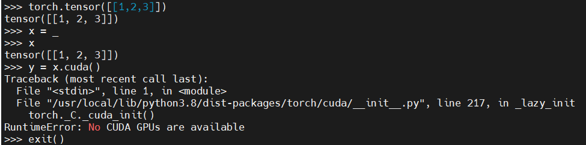
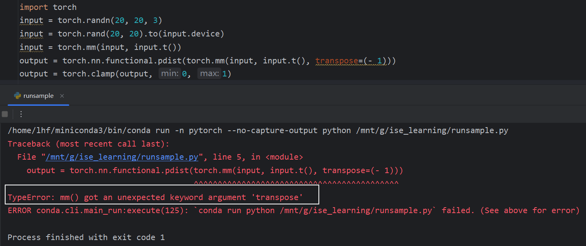
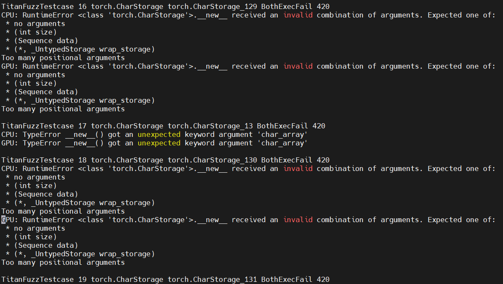
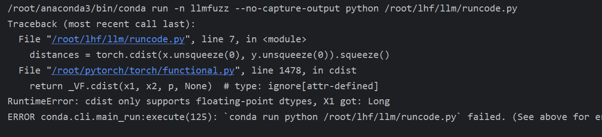

## titanfuzz记录


### 一、遇到的问题及解决方案

#### ①网络问题

又连不上hugging face，之前师兄改的地方不知为啥消失了。

解决方案：在.bashrc文件里找到师兄设置的代理放进去即可

```bash
export http_proxy="http://127.0.0.1:7890"
export https_proxy="http://127.0.0.1:7890"
```


```bash
cd /home/src/run/Results/torch
```


#### ②trace.txt读写权限问题

解决方案：
```bash
chmod +777 trace.txt
```

#### ③用不了GPU



```bash
docker exec -it -w $dest_dir \
    -e CUDA_VISIBLE_DEVICES=${cuda_visible_device} \
    -e TF_FORCE_GPU_ALLOW_GROWTH=true \
    -e TF_CPP_MIN_LOG_LEVEL='3' \
    -e LD_LIBRARY_PATH=/usr/lib/x86_64-linux-gnu/:/usr/local/cuda-11.0/targets/x86_64-linux/lib:/usr/local/cuda/extras/CUPTI/lib64:/usr/local/cuda/lib64:/usr/local/nvidia/lib:/usr/local/nvidia/lib64 \
    --user 1000:1000 \
    $my_container "$@"
```

```bash
docker run --network host --gpus all -itd --name $my_container $my_image
```


解决方案：

1、删除docker容器

```bash
docker rm -f titanfuzz
```

2、重装即可解决，也不知为啥，**好迷惑！**

但好像把之前运行好长时间的torch给删了，又得重新运行了！

3、先跑一个100条指令的！

### 二、内容展示

#### 1、seed

`torch.linalg.lstsq_seed1.py`

```python
A = torch.tensor([[1.0, 2.0], [3.0, 4.0]])
B = torch.tensor([[1.0, 2.0], [1.0, 2.0]])
X = torch.linalg.lstsq(A, B)
```

`torch.linalg.lstsq_seed10.py`

```python
features = torch.randn((1, 3))
labels = torch.randn((1, 1))
weights = torch.linalg.lstsq(features, labels)
```

`torch.linalg.lstsq_seed11.py`

```python
A = torch.tensor([[1.0, 2.0], [3.0, 4.0]])
b = torch.tensor([[1.0], [2.0]])
x = torch.linalg.lstsq(A, b)
```

#### 2、valid

`torch.nn.functional.pdist_391.py`

```python
input = torch.randn(20, 20, 3)
input = torch.transpose(input, 0, 1)
input = torch.clamp(input, min=(- 2), max=2)
input = torch.div(input, 2)
input = torch.transpose(input, 0, 1)
input = torch.clamp(input, min=(- 1), max=1)
input = torch.div(input, 2)
input = torch.rand(20, 20).to(input.device)
input = torch.matmul(input.t(), input)
output = torch.nn.functional.pdist(torch.clamp(input, 0, 1))
```


#### 3、exception

`torch.nn.functional.pdist_149.py`

```python
"""
{"exception": "TypeError", "msg": "mm() got an unexpected keyword argument 'transpose'"}
"""

input = torch.randn(20, 20, 3)
input = torch.rand(20, 20).to(input.device)
input = torch.mm(input, input.t())
output = torch.nn.functional.pdist(torch.mm(input, input.t(), transpose=(- 1)))
output = torch.clamp(output, 0, 1)
```



#### 4、差分测试后的结果（trace.txt）

反馈的是报错信息




### 三、尝试

我在服务器上部署了ollama大模型

```python
import ollama

def generate_code(prompt):
    res = ollama.chat(model="llama3", stream=False, messages=[{"role": "user", "content": f"{prompt}"}],
                      options={"temperature": 0})
    return res['message']['content']

def generate_prompt(library="torch",api="tensor"):
    s = f"Task 1:Import {library}\nTask 2:Generate input data\nTask 3: Call the {api}"
    return s

prompt = generate_prompt("torch","pdist")

print(generate_code(prompt))
```

````python
Here's how you can complete tasks 1-3:

**Task 1: Import Torch**

You can import PyTorch using the following command:
```python
import torch
```
This will allow you to use PyTorch's functionality in your Python script.

**Task 2: Generate input data**

To generate input data, let's assume we want to create a simple dataset of numbers. We'll create two tensors, `x` and `y`, each with 5 elements:
```python
import torch

# Generate some random data
x = torch.tensor([1, 2, 3, 4, 5])
y = torch.tensor([10, 20, 30, 40, 50])

print(x)
print(y)
```
This will output the two tensors:
```
tensor([1, 2, 3, 4, 5])
tensor([10, 20, 30, 40, 50])
```
**Task 3: Call the pdist**

The `pdist` function is used to compute pairwise distances between elements in a tensor. We can use it to calculate the Euclidean distance between our two tensors:
```python
import torch

# Generate some random data
x = torch.tensor([1, 2, 3, 4, 5])
y = torch.tensor([10, 20, 30, 40, 50])

distances = torch.cdist(x.unsqueeze(0), y.unsqueeze(0)).squeeze()

print(distances)
```
This will output the pairwise distances between elements in `x` and `y`. The `cdist` function is used to compute the Euclidean distance between two tensors. We need to add a new dimension to our tensors using `unsqueeze(0)` to make them compatible with the `cdist` function, and then squeeze the resulting tensor to remove the extra dimension.

Note that this is just a simple example, and you may want to modify it based on your specific use case.
````

---


```python
import torch

# Generate some random data
x = torch.tensor([1, 2, 3, 4, 5])
y = torch.tensor([10, 20, 30, 40, 50])

distances = torch.cdist(x.unsqueeze(0), y.unsqueeze(0)).squeeze()

print(distances)
```




从这里也可以看出，大模型生成的代码也会报错，甚至生成错误了！

### 四、几个问题

#### ①差分测试的局限性

如果在GPU与CPU跑，运行的结果一样，但是都是有bug的，这样是不是就检测不出来了？


#### ②如果大模型生成的代码和prompt不一样怎么办？

就比如我的提示词里要生成的api是pdist，但是却产生了cdist


到时候，我们生成代码是不是也是通过这种方式，或者是可以通过这种方式去跑一个demo？ 用类似于titanfuzz那样，生成好的seed去变异，到时候我们也要变异吗？


#### ③我现在要开始构思开题报告了，但目前有一部分还是无从下手？


我们的任务就是根据大模型的反馈去产生更合适、更丰富的prompt，进而进一步去优化生成代码的质量，达到更好的测试效果？


一、选题背景

 

二、选题意义

 

三、国内外文献综述

 

**四、毕业论文（设计）任务要研究或解决的问题和拟采用的研究方法、实验方案及可行性分析：**

**（1）拟解决问题**


**（2）相关技术**


五、研究计划及预期成果

 

六、特色或创新之处

 


